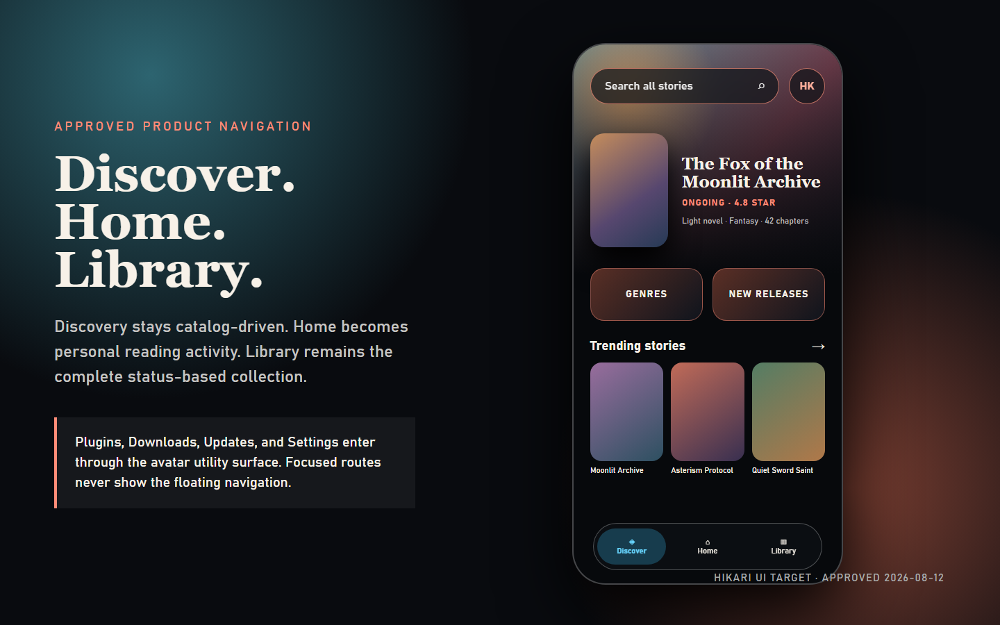
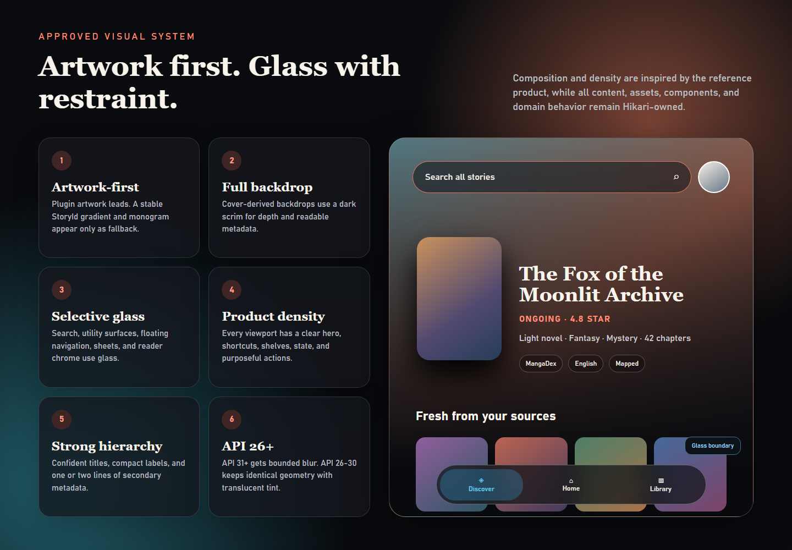
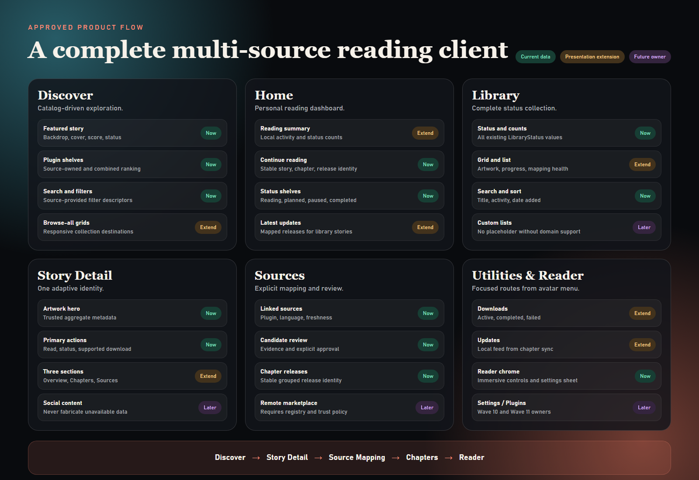

# Hikari ReDantotsu-Inspired Product UI Design

Date: 2026-08-12
Status: APPROVED FOR IMPLEMENTATION

## Goal

Redesign Hikari from a sparse functional catalog shell into a complete multi-source story
discovery, library, source-management, and reading client. The product experience should
closely follow the successful structure and visual density of ReDantotsu while remaining
recognizably Hikari, preserving Hikari's modular architecture, and expressing story and
plugin concepts rather than copying ReDantotsu's anime/manga product model.

The redesign has two required outputs:

1. replace `Hikari-UI-Target-Pack.zip` with an upgraded responsive visual target pack;
2. implement the approved experience in the Hikari Compose application.

The target pack and implementation must describe the same product. The target pack must
not advertise unavailable flows, and the implementation must not silently reduce the
approved visual hierarchy back to the pre-redesign layouts.

## Approved Visual References

The following Hikari-owned mockups are approved implementation references. They contain
only abstract artwork and Hikari product concepts; no ReDantotsu screenshot or asset is
tracked in the repository.







These images are normative for composition, content density, hierarchy, artwork usage,
glass boundaries, and top-level navigation. The written requirements in this spec remain
authoritative for behavior, data ownership, accessibility, responsive reflow, exact copy,
and capability scope. When an image and a written requirement appear to conflict, follow
the written requirement and preserve the image's visual intent without inventing a flow.

## Reference Use

ReDantotsu is a product and visual reference, not a code or asset source.

Hikari adopts these reference qualities:

- artwork-first screens with full-window image backdrops and dark readability gradients;
- prominent search and account/utility access;
- featured content with strong cover, title, score, status, and metadata hierarchy;
- dense horizontal shelves and content-rich lists;
- personal dashboard sections such as continue reading and status-based lists;
- pill-shaped floating navigation and selective glass surfaces;
- rich detail pages with backdrop, cover, primary actions, and organized content;
- source/extension management as a first-class utility flow;
- immersive reader controls that appear only when needed.

Hikari does not copy ReDantotsu source code, logos, bundled artwork, branded content,
domain naming, or licensed UI assets. Target-pack artwork must be original, appropriately
licensed, or abstract. Production artwork comes from Hikari catalog plugins.

## Product Navigation

The three top-level destinations are:

```text
Discover / Home / Library
```

This replaces the existing `Home / Library / Plugins` top-level model.

### Discover

Discover is the multi-source equivalent of ReDantotsu's dedicated content-discovery
pages. It owns catalog browsing, featured stories, source-provided shelves, category
shortcuts, and entry into search.

### Home

Home becomes a personal reading dashboard. It must not duplicate Discover. It summarizes
the local reader's library and progress through continue-reading, reading, planned,
completed, and recent-update sections.

### Library

Library is the full status-based story collection. It supports search, status filtering,
sorting, source/mapping awareness, and responsive grid/list presentation.

### Utility navigation

Plugins is no longer a top-level destination. An avatar/utility entry point opens a sheet
or overlay containing:

- Plugins;
- Downloads;
- Updates;
- Settings;
- diagnostics when appropriate for the build and user context.

The utility entry point must not imply a cloud account or remote profile when Hikari has
no authenticated profile capability. Local reading statistics and a local avatar or
monogram are allowed.

Floating bottom navigation appears only on Discover, Home, and Library. Search, Story,
Plugins, Downloads, Updates, Settings, source mapping, Chapters, and Reader are focused
destinations and do not show the top-level floating navigation.

## Product Flows

### Discover flow

Discover includes:

- prominent search and utility access;
- one featured story chosen from usable catalog data;
- category shortcuts such as genres, latest releases, content types, or source groups;
- horizontal shelves supplied by catalog plugins;
- combined multi-catalog shelves where ranking data supports them;
- browse-all destinations for longer responsive grids;
- filters for source, content type, language, and genre where source data supports them.

The existing `CatalogHomeSnapshot` remains the authoritative source for plugin-owned
sections. The UI may project or group those sections but must not fabricate catalog
content.

Featured selection should prefer an entry with usable artwork and metadata, then apply
existing aggregate score/rank signals. Selection must be deterministic when scores are
equal or missing.

Refreshing one catalog is independent from other catalogs. A failed source keeps its
cached shelves and reports a local failure without replacing successful content from
other sources.

### Personal Home flow

Home combines local reading information into these sections when data exists:

- profile/reading summary;
- continue reading;
- reading;
- want to read or planned;
- paused;
- completed;
- latest updates from mapped reading sources.

The page may omit an empty secondary shelf instead of showing artificial sample content.
A truly empty personal Home provides a useful setup action leading to Discover or Library.

Continue reading uses reading progress and chapter/release identity to resume the actual
reader flow. Status shelves use `LibraryStatus` as their source of truth. Catalog metadata
enriches library items but does not determine membership.

Latest updates are derived from library membership, source mappings, chapter sync data,
and freshness metadata. A story without catalog artwork or complete metadata remains
visible through a stable fallback presentation.

### Library flow

Library supports the existing statuses:

```text
WANT_TO_READ / READING / PAUSED / COMPLETED / DROPPED
```

It includes:

- status tabs or chips with counts;
- title search;
- sort by last activity, title, and date added;
- source or mapping-state filtering when useful;
- grid and list presentation modes;
- cover, title, reading progress, status, and mapping/source health;
- responsive reflow instead of whole-screen scaling.

Grid/list selection is a UI preference and does not alter library data. Custom lists,
bulk editing, and remote social lists remain out of scope until their domain behavior is
specified and implemented.

### Story detail flow

Story Detail uses a rich backdrop-and-cover hero and three presentation sections:

```text
Overview / Chapters / Sources
```

The sections may use tabs or an equivalent adaptive layout. Compact windows use a focused
single-column presentation. Medium and expanded windows may present a two-pane layout
while retaining the same state and actions.

The hero includes available title, aliases, author, content type, score, status, genres,
cover, and backdrop. Primary actions include:

- read or resume;
- change library status;
- download where a readable mapped source exists;
- open the relevant focused section.

Overview aggregates trustworthy metadata from linked catalog entries. Chapters reuses the
existing chapter/release behavior. Sources shows linked and candidate sources with plugin,
language, score, freshness, and mapping state.

Selecting a catalog source for inspection must not silently replace the confirmed reading
mapping. Mapping changes require the existing explicit review and confirmation flow.

Recommendations, comments, social activity, friends, trailers, and remote tracking
features are out of scope. They must not appear as non-functional placeholders.

### Search and source mapping

Search remains a focused destination opened primarily from Discover. It includes source,
content-type, language, and other supported filters while preserving partial results when
one plugin fails.

The Story-to-Reader support flow remains:

```text
Discover or Search
  -> Story Detail
  -> Sources / Find reading source
  -> mapping review and confirmation
  -> Chapters
  -> Reader
```

Mapping UI should adopt the approved artwork-first and glass-sheet language without
weakening canonical story ownership or automatic-link review rules.

### Plugins, Downloads, Updates, and Settings

Plugins uses the runtime registry and installed plugin metadata. It displays installed
state, capabilities, version, update/review state, and diagnostics supported by the
runtime. A remote plugin marketplace is out of scope until a registry and trust policy
exist.

Downloads presents current, completed, and failed work from the download repositories and
workers. It may expose storage state and retry/delete actions already supported by the
domain. It must not invent background capabilities.

Updates is a local feed projected from chapter sync and library mappings. It contains
chapter updates relevant to library stories and links to Story, Chapters, or Reader as
appropriate.

Settings covers appearance, reader, plugin, download/storage, and related local
preferences as those preference capabilities become available. The redesign may establish
the presentation shell and implement preferences required by this approved experience,
such as grid/list mode, motion reduction, and appearance behavior.

### Reader

Reader remains immersive and edge-to-edge. Content takes precedence over decoration.
Controls appear and disappear through the existing tap behavior and provide:

- back navigation;
- story/chapter context;
- previous and next chapter;
- reading progress;
- release/source selection;
- download state;
- typography and reader settings relevant to the content type.

Reader settings and secondary controls use sheets or overlays rather than permanently
reducing the reading viewport.

## Visual Language

### Artwork-first composition

Catalog artwork is a primary visual element. Discover and Story use full-window or hero
backdrops derived from the selected cover or banner. A dark gradient and scrim guarantee
text readability. Cover cards preserve source artwork rather than hiding it behind generic
Material surfaces.

When artwork is missing or fails:

- derive a stable gradient from `StoryId`;
- show a stable title monogram;
- use the same fallback colors for cover and backdrop;
- preserve geometry so content does not jump when loading resolves.

### Glass surfaces

Glass is limited to navigation and transient/floating controls:

- search surfaces;
- avatar/utility entry and utility sheet;
- floating bottom navigation;
- selected overlays, sheets, and reader controls where appropriate.

Content shelves and cover cards do not blur their own contents. API 31 and later may use
real backdrop blur with bounded regions. API 26-30 use an equivalent translucent tinted
surface, border, and shadow with identical layout and semantics.

### Typography and metadata

The visual hierarchy follows the reference's confident, content-led presentation:

- strong display and title styles;
- compact uppercase or emphasized status labels;
- score and release state as clear accents;
- secondary metadata constrained to one or two lines;
- title truncation that preserves usable card density;
- readable novel text independent from discovery typography.

Typography remains a Hikari-owned system and does not copy ReDantotsu fonts or branded
assets.

### Motion

Motion is meaningful and limited to navigation selection, hero/content transitions,
sheet presentation, and control visibility. Spring or parallax effects must degrade to
simple fades or no motion when reduce-motion behavior is enabled. Motion never delays
reader access or blocks interaction.

### Responsive layout

The required visual targets are:

```text
compact phone: 360 x 800 dp
large phone:   412 x 892 dp
medium window: 600 x 960 dp
```

Compact layouts use horizontal shelves and single-column details. Large phones may expose
additional shelf items and metadata. Medium windows use grids, wider shelves, or two-pane
details. The UI reflows at window breakpoints; it does not scale the compact interface.

Touch targets remain at least 48 x 48 dp, system insets are preserved, and the app remains
edge-to-edge.

## Architecture and Ownership

The redesign preserves the accepted module boundaries.

### `:app`

`:app` owns:

- top-level navigation and floating navigation visibility;
- route composition;
- utility-sheet navigation entry;
- application-wide snackbar hosting;
- adaptive app-shell behavior.

It does not absorb feature state or catalog/library behavior.

### `:core:designsystem`

`:core:designsystem` adds only stable domain-neutral primitives proven across multiple
screens, including candidates such as:

```text
HikariArtwork
HikariArtworkBackdrop
HikariGlassSurface
HikariFloatingNavigation
HikariCoverCardFrame
HikariSectionHeader
HikariMetadataBadge
HikariResponsiveContentScaffold
```

The exact names are implementation decisions. The module must not import catalog, story,
library, chapter, download, reader, or plugin models. It accepts generic image references,
colors, labels, selection, callbacks, and content slots.

The design system may define the image-loading presentation contract, but plugin/catalog
features remain responsible for supplying source URLs and accessibility labels. Image
networking and caching must not create a dependency from the design system into capability
or plugin modules.

### `:feature:catalog`

`:feature:catalog` owns domain-aware presentation for:

- Discover;
- personal Home;
- Library;
- Search;
- Story Detail;
- Chapters;
- source mapping;
- catalog/library-specific cards, shelves, heroes, filters, and projections.

Feature-owned projection or query classes may combine existing repositories for UI
purposes. Do not create a new production domain module solely to support screen layout.

### `:feature:reader`

`:feature:reader` retains reader state, actions, content presentation, controls, release
selection, and reader-specific settings UI.

### Utility presentation

Plugins, Downloads, Updates, and Settings must be placed according to the repository's
approved roadmap and module boundaries. This redesign does not authorize capability logic
to move into `:app` or `:core:designsystem`. If a planned presentation module is not yet
present, implementation sequencing must introduce it only when consistent with the
current architecture roadmap and verification policy.

## Data Flow

### Discover projection

Discover observes all available `CatalogHomeSnapshot` values and aggregate ranked
stories. It exposes:

- source-owned shelves;
- combined ranked shelves;
- deterministic featured content;
- selected source/filter state;
- independent refresh state and failure by plugin.

Cached content remains visible during refresh and partial failures.

### Home projection

Home combines:

- `LibraryEntry` membership and status;
- catalog metadata;
- reading progress;
- mapped chapters and freshness;
- download state where useful for resume presentation.

The projection groups items for display but does not redefine library membership,
chapter identity, or reading progress rules.

### Library projection

Library remains backed by `LibraryEntry`. Search, sort, filters, presentation mode, and
catalog enrichment are presentation concerns. Missing enrichment never removes a library
entry.

### Story projection

Story Detail retains the existing canonical story and selected-source identities. It
aggregates safe metadata for Overview and exposes existing mapping/chapter states to the
Sources and Chapters sections. Presentation tabs do not create independent feature state
machines.

### Artwork data flow

Cover and backdrop use one shared artwork request and cache identity. The backdrop must
reuse the already requested artwork rather than initiate a second independent network
request. Memory and disk caching should prevent repeated decode and download across shelf,
Story, and back-stack navigation.

## Loading, Error, and Offline Behavior

Initial loading without usable content uses shaped skeletons or the accepted shared
loading presentation. Refresh with cached content keeps the screen visible and uses local
progress.

Partial source failures are inline or snackbar feedback. A full-screen error is reserved
for a destination with no usable content. Offline behavior keeps cached Discover, Home,
Library, Story, Chapters, Downloads, and Reader content where those capabilities support
it.

The established feature-to-design-system mapping boundary remains unchanged: features
classify errors and supply copy/actions; the design system renders generic presentation.

## Accessibility

- artwork has caller-provided content descriptions or is explicitly decorative;
- cover-card semantics include title and meaningful metadata independent of artwork;
- status and errors are not communicated by color alone;
- glass surfaces meet readable contrast in both blur and translucent fallback modes;
- navigation selection is exposed through semantics;
- all interactive controls meet minimum touch targets;
- reduce-motion behavior is respected;
- reader typography remains legible under font scaling;
- screen structure remains usable with TalkBack and keyboard/D-pad navigation where
  applicable.

## Target Pack

The upgraded target pack replaces the sparse existing pack and contains at minimum:

- a visual-system overview;
- Discover, Home, Library, Search, Story Overview, Story Chapters, Story Sources,
  mapping, chapter list, plugin manager, downloads, updates, settings shell, and Reader;
- compact references for the full critical flow;
- large-phone references for Discover, Home, Library, and Story;
- medium-window references for Discover, Home, Library, and adaptive Story;
- loading, empty, error, partial-failure, and offline states;
- dark and light reference coverage;
- annotations for API 31+ glass and API 26-30 fallback behavior.

The pack must use 2x exports while recording dimensions in dp, preserve the 4 dp grid and
16 dp baseline screen padding, and represent real production behavior without fake social,
recommendation, marketplace, or account flows.

## Testing and Verification

### Design-system tests

Verify:

- artwork fallback determinism;
- shared cover/backdrop request identity;
- glass and translucent fallback behavior;
- selected navigation semantics;
- minimum touch targets;
- metadata and contrast semantics;
- reduce-motion behavior where testable.

### Projection and ViewModel tests

Verify:

- deterministic featured selection;
- partial catalog refresh and cached-content retention;
- continue-reading grouping and resume identity;
- library status shelves and counts;
- update ordering and library relevance;
- library filtering and sorting;
- source aggregation without implicit remapping;
- missing metadata/artwork fallback retention.

### Navigation tests

Verify:

- Discover, Home, and Library are the only top-level destinations;
- utility routes open from the avatar entry point;
- Search, Story, mapping, Chapters, and Reader preserve expected back-stack behavior;
- floating navigation is hidden on focused destinations;
- reader back/resume behavior preserves chapter and release identity.

### Screenshot and instrumentation tests

Add screenshot or golden coverage for Discover, Home, Library, Story, and Reader at the
approved compact, large-phone, and medium sizes, including dark/light and loading, empty,
error, and offline states.

Instrumentation covers these critical journeys:

```text
Discover -> Story -> Sources -> Chapters -> Reader
Home -> Resume Reader
Library -> Search/Filter/Sort -> Story
Avatar utility -> Plugins / Downloads / Updates / Settings
```

### Performance review

Verify that:

- cover and backdrop do not independently download or decode the same artwork;
- scrolling shelves and grids do not apply per-item backdrop blur;
- API 26 fallback remains responsive with a realistic item count;
- navigation and sheet animation remain smooth on supported devices;
- large cached lists do not trigger avoidable full-screen recomposition.

### Final checkpoint

The final checkpoint runs the repository's full verification, architecture guards,
unit tests, lint, Detekt, assembly, instrumentation on API 26 and a current API level,
responsive visual review, target-pack review, and a deep product-flow review before
acceptance.

## Scope Boundaries

This redesign includes UI and the minimal projections/preferences required to present
existing Hikari capabilities as an integrated product.

It does not include:

- copying ReDantotsu code or assets;
- AniList or other remote social/account integration;
- comments, friends, activity feeds, or social profiles;
- recommendations without an approved data source;
- a remote plugin marketplace without registry and trust architecture;
- fabricated statistics or catalog content;
- new content-hosting behavior;
- weakening plugin sandbox, capability, canonical-story, Room-schema, or module-boundary
  contracts;
- unrelated capability refactors.

## Acceptance Criteria

The design is accepted when:

1. the top-level product model is Discover, Home, and Library;
2. the product visibly matches the approved ReDantotsu-inspired artwork-first, dense,
   floating-glass direction while remaining branded and modeled as Hikari;
3. Home and Discover have distinct purposes;
4. Story, source mapping, Chapters, and Reader form one coherent critical flow;
5. Plugins, Downloads, Updates, and Settings are reachable through utility navigation;
6. no unavailable social, recommendation, marketplace, or cloud-account capability is
   presented as functional;
7. API 26-30 receives a coherent non-blur fallback and API 31+ may enhance it with blur;
8. target pack and production UI describe the same responsive behavior;
9. module ownership and architecture verification remain intact;
10. the full checkpoint and deep visual/product review pass.
